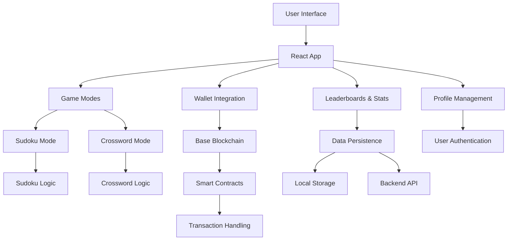

# Based Puzzles

<div align="center">
  
  
  
  
</div>

<div align="center">
  <h3>Challenge Yourself with Base-Themed Puzzles!</h3>
  <p>A modern, responsive puzzle app featuring Sudoku and crypto-themed Crosswords</p>
  <p>Built for the Base ecosystem with sleek design and addictive gameplay</p>
</div>

---

## Features

### Game Modes
- **Sudoku**: Classic 9×9 grid with multiple difficulty levels
- **Crossword**: Base/crypto-themed clues and puzzles
- **Daily Challenges**: New puzzles every day to keep you coming back

### Competitive Elements
- **Leaderboards**: Compete with friends and global players
- **Personal Stats**: Track your progress, streaks, and achievements
- **Timed Mode**: Race against the clock for extra challenge

### User Experience
- **Dark/Light Theme**: Automatic theme switching with manual toggle
- **Responsive Design**: Perfect on desktop, tablet, and mobile
- **Keyboard Navigation**: Full keyboard support for power users
- **Local Persistence**: Your progress saves automatically

### Technical Highlights
- **Modern Stack**: React 19, TypeScript, Tailwind CSS, Vite
- **Performance**: Optimized with Vite for lightning-fast builds
- **Accessibility**: ARIA labels and keyboard navigation
- **Type Safety**: Full TypeScript coverage

---

## Tech Stack

- **Frontend**: React 19, TypeScript
- **Styling**: Tailwind CSS with custom design system
- **Build Tool**: Vite 6
- **Icons**: Lucide React
- **UI Components**: Radix UI primitives
- **State Management**: React Query for server state
- **Routing**: Wouter (lightweight React router)
- **Forms**: React Hook Form with Zod validation

---

## Architecture

The application follows a modular architecture designed for scalability and maintainability.



### Component Architecture
- **Components**: Modular UI components organized by feature (sudoku, crossword, ui primitives)
- **Hooks**: Custom React hooks for game logic, data fetching, and state management
- **Lib**: Utility functions, game algorithms, and configuration
- **Pages**: Route-based page components for navigation

### Data Flow
- User interactions trigger state updates via React hooks
- Game logic is handled in custom hooks with local state persistence
- Blockchain integration manages wallet connections and transactions
- Leaderboards and stats are fetched from backend services

---

## Installation

### Prerequisites
- Node.js 18+ and npm/pnpm
- Git

### Quick Start

1. **Clone the repository**
   ```bash
   git clone https://github.com/yourusername/based-puzzles.git
   cd based-puzzles
   ```

2. **Install dependencies**
   ```bash
   npm install
   # or
   pnpm install
   ```

3. **Start development server**
   ```bash
   npm run dev
   # or
   pnpm dev
   ```

4. **Open your browser**
   Navigate to `http://localhost:5173`

### Build for Production

```bash
npm run build
npm run preview
```

---

## How to Play

### Sudoku
- Click a cell and use your keyboard (1-9) or the number pad
- Use arrow keys to navigate
- Check your solution or get hints when stuck

### Crossword
- Click a cell and type letters
- Use arrow keys or click clues to navigate
- Across and down clues guide your solving

### Daily Challenges
- New puzzles available every day
- Compete on daily leaderboards
- Build your solving streak!

---

## Project Structure

```
src/
├── components/          # Reusable UI components
│   ├── ui/             # Base UI primitives
│   ├── sudoku/         # Sudoku-specific components
│   ├── crossword/      # Crossword-specific components
│   └── modes/          # Game mode wrappers
├── hooks/              # Custom React hooks
├── lib/                # Utilities and game logic
├── pages/              # Route components
└── types.ts            # TypeScript type definitions
```

---

## Contributing

We welcome contributions! Here's how to get started:

1. Fork the repository
2. Create a feature branch: `git checkout -b feature/amazing-feature`
3. Commit your changes: `git commit -m 'Add amazing feature'`
4. Push to the branch: `git push origin feature/amazing-feature`
5. Open a Pull Request

### Development Guidelines
- Use TypeScript for all new code
- Follow the existing code style
- Add tests for new features
- Update documentation as needed

---

## License

This project is licensed under the MIT License - see the [LICENSE](LICENSE) file for details.

---

## Acknowledgments

- Built for the Base ecosystem
- Inspired by classic puzzle games
- Thanks to the open-source community

---

<div align="center">
  <p>Happy puzzling!</p>
  <p>Made on Base</p>
</div>