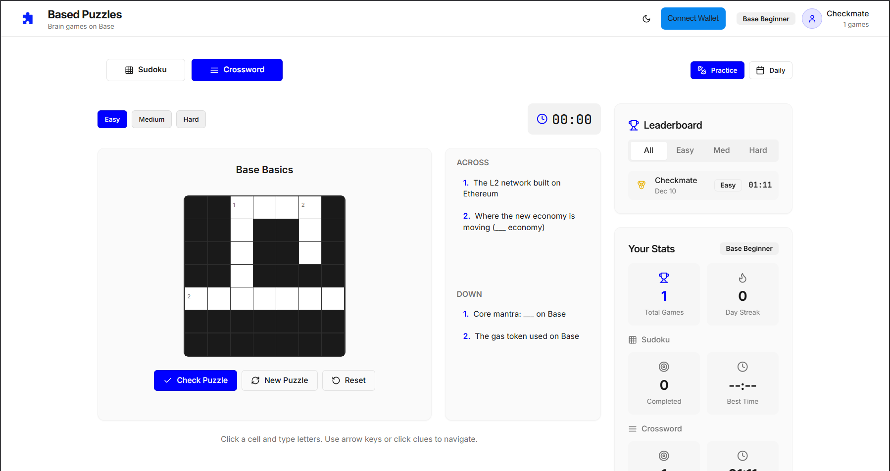
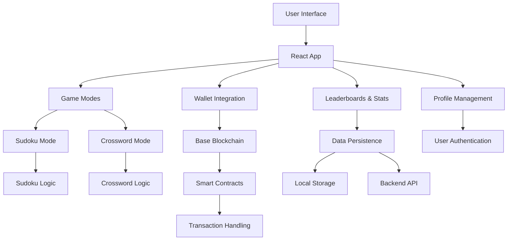

# Based Puzzles

<div align="center">
  
  
  
  
</div>

## Live Demo

**Based Puzzles is now live!**  
🔗 [https://based-puzzles.vercel.app/](https://based-puzzles.vercel.app/)



The ultimate puzzle gaming experience built on Base blockchain. Challenge yourself with Sudoku and crypto-themed Crosswords, compete on leaderboards, and enjoy seamless Web3 integration. A modern, responsive puzzle app designed for the Base ecosystem with sleek design and addictive gameplay.

---

## Features

### Game Modes
- **Sudoku**: Classic 9×9 grid with multiple difficulty levels
- **Crossword**: Base/crypto-themed clues and puzzles
- **Daily Challenges**: New puzzles every day to keep you coming back

### Competitive Elements
- **Leaderboards**: Compete with friends and global players
- **Personal Stats**: Track your progress, streaks, and achievements
- **Timed Mode**: Race against the clock for extra challenge

### User Experience
- **Dark/Light Theme**: Automatic theme switching with manual toggle
- **Responsive Design**: Perfect on desktop, tablet, and mobile
- **Keyboard Navigation**: Full keyboard support for power users
- **Local Persistence**: Your progress saves automatically

### Technical Highlights
- **Modern Stack**: React 19, TypeScript, Tailwind CSS, Vite
- **Performance**: Optimized with Vite for lightning-fast builds
- **Accessibility**: ARIA labels and keyboard navigation
- **Type Safety**: Full TypeScript coverage

---

## Screenshots

### Game Interface


### Leaderboard


### Profile Stats


---

## Tech Stack

- **Frontend**: React 19, TypeScript
- **Styling**: Tailwind CSS with custom design system
- **Build Tool**: Vite 6
- **Icons**: Lucide React
- **UI Components**: Radix UI primitives
- **State Management**: React Query for server state
- **Routing**: Wouter (lightweight React router)
- **Forms**: React Hook Form with Zod validation

---

## Architecture

The application follows a modular architecture designed for scalability and maintainability.



### Component Architecture
- **Components**: Modular UI components organized by feature (sudoku, crossword, ui primitives)
- **Hooks**: Custom React hooks for game logic, data fetching, and state management
- **Lib**: Utility functions, game algorithms, and configuration
- **Pages**: Route-based page components for navigation

### Data Flow
- User interactions trigger state updates via React hooks
- Game logic is handled in custom hooks with local state persistence
- Blockchain integration manages wallet connections and transactions
- Leaderboards and stats are fetched from backend services

---

## Backend Integration

This frontend application integrates with a backend service for persistent data storage and blockchain interactions. For detailed backend integration documentation, see [backend-integration.md](backend-integration.md).

### Key Integration Points
- **Leaderboard Data**: Fetched from backend API for global rankings
- **User Statistics**: Stored and retrieved from backend for cross-device sync
- **Blockchain Transactions**: Handled through wallet integration for rewards and payments
- **Daily Challenges**: Generated and validated server-side for fairness

---

## Installation

### Prerequisites
- Node.js 18+ and npm/pnpm
- Git

### Quick Start

1. **Clone the repository**
   ```bash
   git clone https://github.com/yourusername/based-puzzles.git
   cd based-puzzles
   ```

2. **Install dependencies**
   ```bash
   npm install
   # or
   pnpm install
   ```

3. **Start development server**
   ```bash
   npm run dev
   # or
   pnpm dev
   ```

4. **Open your browser**
   Navigate to `http://localhost:5173`

### Build for Production

```bash
npm run build
npm run preview
```

---

## Deployment

The application is configured for deployment on Vercel with the included `vercel.json` configuration. The build output is optimized for static hosting.

### Vercel Deployment
1. Connect your repository to Vercel
2. Configure environment variables if needed
3. Deploy automatically on push to main branch

### Manual Deployment
- Build the project: `npm run build`
- Serve the `dist` folder on any static host (Netlify, GitHub Pages, etc.)

---

## How to Play

### Sudoku
- Click a cell and use your keyboard (1-9) or the number pad
- Use arrow keys to navigate
- Check your solution or get hints when stuck

### Crossword
- Click a cell and type letters
- Use arrow keys or click clues to navigate
- Across and down clues guide your solving

### Daily Challenges
- New puzzles available every day
- Compete on daily leaderboards
- Build your solving streak!

---

## Project Structure

```
src/
├── components/          # Reusable UI components
│   ├── ui/             # Base UI primitives
│   ├── sudoku/         # Sudoku-specific components
│   ├── crossword/      # Crossword-specific components
│   └── modes/          # Game mode wrappers
├── hooks/              # Custom React hooks
├── lib/                # Utilities and game logic
├── pages/              # Route components
└── types.ts            # TypeScript type definitions
```

---

## Contributing

We welcome contributions from the community! Whether you're fixing bugs, adding features, or improving documentation, your help is appreciated.

### Getting Started

1. **Fork the repository** on GitHub
2. **Clone your fork** locally: `git clone https://github.com/yourusername/based-puzzles.git`
3. **Create a feature branch**: `git checkout -b feature/your-feature-name`
4. **Install dependencies**: `npm install` or `pnpm install`
5. **Start development**: `npm run dev`

### Development Workflow

1. **Make your changes** following the guidelines below
2. **Test your changes** thoroughly
3. **Commit your changes**: `git commit -m 'feat: add your feature description'`
4. **Push to your branch**: `git push origin feature/your-feature-name`
5. **Open a Pull Request** with a clear description of your changes

### Development Guidelines

- **Code Style**: Follow the existing TypeScript and React patterns
- **TypeScript**: Use TypeScript for all new code with proper type annotations
- **Testing**: Add unit tests for new features and ensure existing tests pass
- **Documentation**: Update README and inline comments as needed
- **Commits**: Use conventional commit format (feat, fix, docs, style, refactor, test, chore)
- **Pull Requests**: Provide clear descriptions and link related issues

### Areas for Contribution

- Bug fixes and performance improvements
- New puzzle types or game modes
- UI/UX enhancements
- Accessibility improvements
- Documentation updates
- Test coverage expansion

---

## License

This project is licensed under the MIT License - see the [LICENSE](LICENSE) file for details.

---

## Acknowledgments

This project is built for the Base ecosystem and draws inspiration from classic puzzle games. Special thanks to:

- The Base community for their innovative blockchain platform
- Open-source contributors to React, TypeScript, and related libraries
- The puzzle game community for timeless entertainment concepts

---

<div align="center">
  <p>Happy puzzling!</p>
  <p>Built on Base</p>
</div>